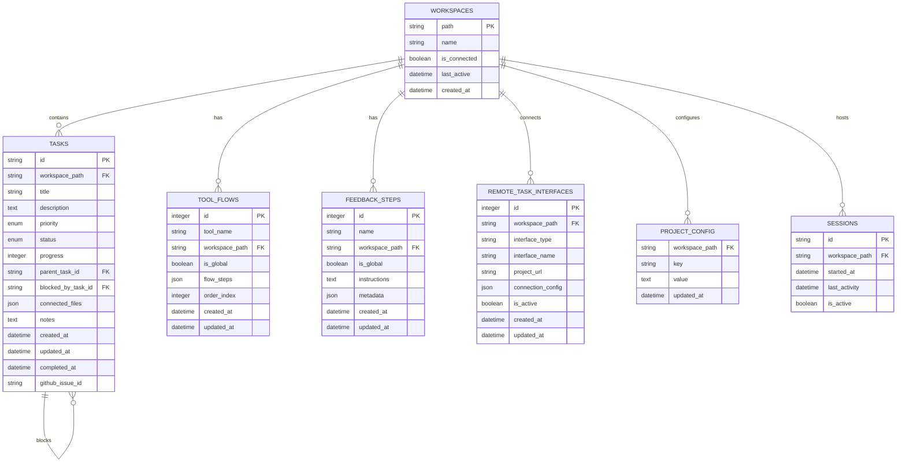

# TaskPilot MCP Server Architecture

## Phase 3: Remote Hosting & UI Integration Architecture Decisions

### Overview

This document captures the confirmed architectural decisions made during Phase 3 development for remote hosting and UI integration capabilities. These decisions represent the current production architecture after extensive implementation and testing.

### 1. Composite Feedback Step Approach (Option A)

**Decision**: Use single composite feedback step for multiple rule contexts instead of separate feedback steps.

**Implementation**:
- Single "workspace_context" feedback step for start/init tools
- Variable substitution combines: standard rules + workspace rules + analytical framework
- LLM receives comprehensive context in one response

**Alternative Rejected**: Separate feedback steps for each rule type (would require multiple LLM calls)

**Benefits**: Single context delivery, reduced API calls, comprehensive rule awareness, improved LLM context understanding.

### 2. Workspace Lifecycle Management 

**Decision**: Implement automatic workspace lifecycle with timing-based status transitions.

**Lifecycle States**:
- **Active**: Recent interaction (MCP call, API request, or UI activity)
- **Idle**: No activity for 5 minutes → automatic transition
- **Inactive**: Idle for additional 5 minutes → automatic transition

**Activity Tracking**:
- MCP tool executions
- REST API requests  
- Task updates
- UI interactions

**Benefits**: Automatic resource management, clear status indication, performance optimization.

### 3. SSE+REST Hybrid Communication Pattern

**Decision**: Use Server-Sent Events (SSE) for real-time updates combined with REST API for commands.

**Architecture**:
- **REST Endpoints**: HTTP commands from UI to backend
- **SSE Stream**: Real-time events from backend to UI
- **Dual Protocol Support**: MCP over SSE + REST API on same port (3001)

**SSE Event Types**:
- `workspace.status_changed` - Workspace lifecycle updates
- `task.updated` - Task progress changes
- `task.created` - New task notifications

**Benefits**: Real-time UI updates, efficient server-to-client communication, proper separation of concerns.

### 4. Database Locations

**Decision**: Split data across two database locations for proper scoping and performance.

**Database Architecture**:
- **Global Database**: `~/.taskpilot/global.db`
  - Workspaces registry and metadata
  - Session management
  - Global tool flows and feedback steps
  - MCP server mappings
  - Cross-workspace shared data

- **Workspace Database**: `{workspace}/.taskpilot/task.db` (per workspace)
  - Task management and tracking
  - GitHub configurations  
  - Remote interface settings
  - Workspace-specific data
  - On-demand initialization when workspace accessed

**Benefits**: Clear data separation, improved performance, proper workspace isolation, reduced database contention.

### 5. Minimal API Endpoint Strategy

**Decision**: Design minimal core endpoints with on-demand expansion during UI development.

**Core 6 REST Endpoints**:
1. `GET /api/workspaces` - List all discovered workspaces
2. `GET /api/workspaces/{id}/tasks` - Get workspace tasks  
3. `GET /api/workspaces/{id}/tool-flows` - Get workspace tool flows
4. `GET /api/workspaces/{id}/feedback-steps` - Get workspace feedback steps
5. `POST /api/workspaces/{id}/tasks` - Create new task
6. `PUT /api/workspaces/{id}/tasks/{taskId}` - Update task

**Benefits**: Prevents endpoint bloat, focused API surface, extensible design, real-time capabilities.

### 6. Drizzle ORM Integration

**Decision**: Replace manual SQL with Drizzle ORM for type safety and developer experience.

**Implementation**:
- TypeScript schema definitions for compile-time safety
- Automatic type inference for queries and results
- Migration system with SQL fallback for development
- Dual database support (global + workspace)

**Benefits**: Type safety, better IDE support, reduced SQL errors, improved maintainability.

### 7. Embedded Data Distribution

**Decision**: Embed all external data files as TypeScript constants for clean distribution.

**Implementation**:
- All JSON seed data embedded in `src/data/embedded-seed-data.ts`
- Database schemas embedded via Drizzle TypeScript definitions  
- No external file dependencies in distribution package

**Benefits**: Single-file distribution, no missing file errors, simplified deployment.

## System Architecture Overview - Prompt Orchestration Flow


## Prompt Orchestration Flow


## Web UI Workspace Navigation Flow


## Database Schema



## Tool Flow Structure (JSON Schema)

```json
{
  "tool_name": "taskpilot_add",
  "workspace_path": "/path/to/project",
  "is_global": false,
  "flow_steps": [
    {
      "step_order": 1,
      "system_tool_fn": "taskpilot_add",
      "feedback_step": "analytical_validation",
      "next_tool": "taskpilot_create_task"
    },
    {
      "step_order": 2,
      "system_tool_fn": "taskpilot_create_task",
      "feedback_step": "post_task_validation",
      "next_tool": "end"
    }
  ]
}
```

## Feedback Step Structure (JSON Schema)

```json
{
  "name": "analytical_validation",
  "workspace_path": "/path/to/project",
  "is_global": true,
  "instructions": "Apply the 6-step analytical thinking framework:\n1. **Logical Consistency**: Evaluate statements for internal coherence and contradictions\n2. **Evidence Quality**: Assess the strength and reliability of supporting data/reasoning\n3. **Hidden Assumptions**: Identify unstated premises that may affect outcomes\n4. **Cognitive Biases**: Detect emotional reasoning, confirmation bias, or wishful thinking\n5. **Causal Relationships**: Verify claimed cause-and-effect relationships are valid\n6. **Alternative Perspectives**: Consider competing explanations or approaches\n\nIf validation passes, proceed to create the task. If validation fails, provide constructive feedback with specific suggestions for improvement.",
  "metadata": {
    "category": "validation",
    "required_tools": ["taskpilot_create_task"],
    "timeout_minutes": 5
  }
}
```

## Web UI Structure - Mobile App Style Interface

### Floating Static Navigation

```mermaid
graph TB
    subgraph FloatingNav ["📱 Static Bottom Navigation"]
        HOME_NAV["🏠 Home"]
        TOOLS_NAV["🔄 Tool Flows"]
        FEEDBACK_NAV["📝 Feedback Steps"]
    end
    
    subgraph MainScreen ["Main Screen Area"]
        CONTENT["Dynamic Content Based on Nav Selection"]
    end
    
    FloatingNav --- MainScreen
```


### Home Screen - Workspace List

```mermaid
graph TB
    HOME_SCREEN["🏠 Home Screen"] --> WS_CONNECTED["Connected Workspaces ✅"]
    HOME_SCREEN --> WS_DISCONNECTED["Disconnected Workspaces ❌"]
    
    WS_CONNECTED --> WS_CARD1["Project Alpha<br/>/home/user/project1<br/>Last Active: 2 min ago"]
    WS_DISCONNECTED --> WS_CARD2["Project Beta<br/>/var/www/webapp<br/>Last Active: 2 days ago"]
```


### Tool Flows Screen

```mermaid
graph TB
    TOOLS_SCREEN["🔄 Tool Flows Screen"] --> TOOLS_TABS["Tab Navigation"]
    
    TOOLS_TABS --> TF_GLOBAL["Global Tab<br/>(Read-only)"]
    TOOLS_TABS --> TF_WORKSPACE["Workspace Tab<br/>(Editable)"]
    
    TF_GLOBAL --> TF_GLOBAL_ITEMS["taskpilot_add<br/>taskpilot_status<br/>taskpilot_github<br/>[Edit Button] → Clone to Workspace"]
    
    TF_WORKSPACE --> TF_WS_ITEMS["Custom taskpilot_add<br/>Modified workflows<br/>[Edit/Delete Buttons]"]
```


### Feedback Steps Screen

```mermaid
graph TB
    FEEDBACK_SCREEN["📝 Feedback Steps Screen"] --> FEEDBACK_TABS["Tab Navigation"]
    
    FEEDBACK_TABS --> FS_GLOBAL["Global Tab<br/>(Read-only)"]
    FEEDBACK_TABS --> FS_WORKSPACE["Workspace Tab<br/>(Editable)"]
    
    FS_GLOBAL --> FS_GLOBAL_ITEMS["analytical_validation<br/>post_task_validation<br/>code_review<br/>[Edit Button] → Clone to Workspace"]
    
    FS_WORKSPACE --> FS_WS_ITEMS["workspace_rules (dynamic)<br/>custom_validation<br/>[Edit/Delete Buttons]"]
```


## Tool Flow Card Structure (3-Part Unit Block)

**Important**: Not all 3 blocks are required. Feedback steps and next tool calls are optional depending on the tool's purpose.

### Complete Flow Example (taskpilot_add)


### Simple Flow Example (taskpilot_create_task)


### Flow Examples by Tool Type

| Tool | System Function | Feedback Step | Next Tool | Reason |
|------|----------------|---------------|-----------|---------|
| `taskpilot_add` | ✓ | analytical_validation | taskpilot_create_task | Needs validation before creation |
| `taskpilot_create_task` | ✓ | (none) | end | Direct execution, no feedback needed |
| `taskpilot_status` | ✓ | status_analysis | end | Analysis only, no follow-up |
| `taskpilot_github` | ✓ | github_validation | taskpilot_update | May need task updates after sync |
| `taskpilot_rule_update` | ✓ | (none) | end | Direct rule creation, no feedback needed |

### UI Component Structure


## Web UI Routing Structure - Mobile App Style

### Simplified Mobile-Style Navigation

```mermaid
graph TB
    HOME["🏠 Home Page<br/>Workspace List"] --> NAV["📱 Floating Static Nav"]
    
    NAV --> HOME_TAB["🏠 Home"]
    NAV --> TOOLS_TAB["🔄 Tool Flows"]
    NAV --> FEEDBACK_TAB["📝 Feedback Steps"]
    
    TOOLS_TAB --> TF_GLOBAL["Global Tab"]
    TOOLS_TAB --> TF_WORKSPACE["Workspace Tab"]
    
    FEEDBACK_TAB --> FS_GLOBAL["Global Tab"]
    FEEDBACK_TAB --> FS_WORKSPACE["Workspace Tab"]
    
    TF_GLOBAL --> TF_EDIT["Edit Button → Clone to Workspace"]
    FS_GLOBAL --> FS_EDIT["Edit Button → Clone to Workspace"]
```


### Workspace-Based Routing


### Default Fallback Logic
```
If workspace variant exists:
  Use workspace version
Else:
  Use global variant (read-only)
  Show "Edit" button to clone to workspace
```

## Analytical Thinking Framework Implementation


## Workspace Rules Management System

### Dynamic Feedback Step Updates

Workspace rules are managed as dynamic feedback steps that get updated when trigger phrases are detected. There is no separate `workspace_rules` table - instead, workspace feedback steps are modified to include new rules.

#### Trigger Phrases Detection
```
Trigger Words: "never", "always", "remember", "don't", "do not"

Examples:
- "Never use var, always use const or let"
- "Remember to add unit tests for all new functions"
- "Don't commit without running the linter"
- "Always update the changelog when adding features"
```

#### Rule Update Flow (Feedback Step Modification)


#### Global + Workspace Rules Integration
- **Global Rules**: Base guidelines in global feedback steps (immutable)
- **Workspace Rules**: Dynamic additions to workspace feedback steps (editable)
- **LLM Context**: Both global and workspace rules provided in `taskpilot_start` and `taskpilot_init` responses

## Global Configuration Seed Structure

### Global Tool Flows (JSON Database Seed)
```json
{
  "global_tool_flows": [
    {
      "tool_name": "taskpilot_add",
      "flow_steps": [
        {
          "step_order": 1,
          "system_tool_fn": "taskpilot_add",
          "feedback_step": "analytical_validation",
          "next_tool": "taskpilot_create_task"
        }
      ]
    },
    {
      "tool_name": "taskpilot_status",
      "flow_steps": [
        {
          "step_order": 1,
          "system_tool_fn": "taskpilot_status",
          "feedback_step": "status_analysis",
          "next_tool": "end"
        }
      ]
    },
    {
      "tool_name": "taskpilot_rule_update",
      "flow_steps": [
        {
          "step_order": 1,
          "system_tool_fn": "taskpilot_rule_update",
          "feedback_step": null,
          "next_tool": "end"
        }
      ]
    }
  ]
}
```

### Global Feedback Steps (JSON Database Seed)
```json
{
  "global_feedback_steps": [
    {
      "name": "analytical_validation",
      "instructions": "Apply the 6-step analytical thinking framework:\n1. **Logical Consistency**: Evaluate statements for internal coherence and contradictions\n2. **Evidence Quality**: Assess the strength and reliability of supporting data/reasoning\n3. **Hidden Assumptions**: Identify unstated premises that may affect outcomes\n4. **Cognitive Biases**: Detect emotional reasoning, confirmation bias, or wishful thinking\n5. **Causal Relationships**: Verify claimed cause-and-effect relationships are valid\n6. **Alternative Perspectives**: Consider competing explanations or approaches\n\nIf validation passes, call the next tool. If validation fails, provide constructive feedback.",
      "metadata": {
        "category": "validation",
        "timeout_minutes": 5
      }
    },
    {
      "name": "post_task_validation",
      "instructions": "After task completion:\n1. Run all relevant unit tests for modified code\n2. Check code formatting and linting\n3. Verify task progress is accurately recorded\n4. Update connected file list\n5. Create git commit with task reference\n\nOnly mark task as 100% complete when all checks pass.",
      "metadata": {
        "category": "completion",
        "timeout_minutes": 10
      }
    }
  ]
}
```

### Database Seed File Naming Convention

**CRITICAL DESIGN PRINCIPLE**: All JSON files used for database seeding must follow the `*-db-seed.json` naming pattern to clearly distinguish them from regular configuration files.

**File Structure:**
- `src/data/global-tool-flows-db-seed.json` - Tool flow configurations for database seeding
- `src/data/global-feedback-steps-db-seed.json` - Feedback step templates for database seeding
- Future seed files: `[feature]-db-seed.json` pattern

**Template Engine Design Rules:**
1. **NO HARDCODED TEMPLATES** - All response formatting must be in database-stored feedback steps
2. **Variable Substitution**: Use `{{context.variable}}` syntax in feedback step templates
3. **MCP Tools**: Only provide context data and return `orchestrationResult.prompt_text`
4. **Database First**: JSON files are seed data - all lookups happen against database, not files
5. **Template Storage**: All templates stored in `feedback_steps` table with `{{context.variable}}` placeholders

### Remote Task Interfaces Configuration

```json
{
  "remote_task_interfaces": [
    {
      "interface_type": "github",
      "interface_name": "GitHub Issues",
      "example_config": {
        "repository_url": "https://github.com/owner/repo",
        "access_token": "encrypted_token",
        "webhook_url": "https://api.github.com/repos/owner/repo/hooks",
        "sync_enabled": true
      }
    },
    {
      "interface_type": "jira",
      "interface_name": "Jira Software",
      "example_config": {
        "project_url": "https://company.atlassian.net/browse/PROJECT",
        "api_endpoint": "https://company.atlassian.net/rest/api/3",
        "username": "user@company.com",
        "api_token": "encrypted_token",
        "project_key": "PROJECT"
      }
    },
    {
      "interface_type": "linear",
      "interface_name": "Linear",
      "example_config": {
        "team_url": "https://linear.app/company/team/TEAM",
        "api_endpoint": "https://api.linear.app/graphql",
        "api_key": "encrypted_key",
        "team_id": "team_uuid"
      }
    }
  ]
}
```

## Component Interaction Matrix

| Component | taskpilot_start | taskpilot_add | taskpilot_status | taskpilot_github | taskpilot_rule_update |
|-----------|----------------|---------------|------------------|------------------|-----------------------|
| Flow Orchestrator | ✓ Primary | ✓ Primary | ✓ Primary | ✓ Primary | ✓ Primary |
| Feedback Manager | ✓ Context | ✓ Primary | ✓ Analysis | ✓ Validation | ○ Minimal |
| Session Manager | ✓ Primary | ○ Minimal | ○ Minimal | ○ Minimal | ○ Minimal |
| Rule Detector | ○ Minimal | ○ Minimal | ○ Minimal | ○ Minimal | ✓ Primary |
| Workspace Rule Manager | ✓ Context | ○ Minimal | ○ Minimal | ○ Minimal | ✓ Primary |
| Prompt Generator | ✓ Primary | ✓ Primary | ✓ Primary | ✓ Primary | ✓ Primary |
| Database | ✓ Read/Write | ✓ Read | ✓ Read | ✓ Read/Write | ✓ Write |

**Legend:**
- ✓ Primary: Core functionality dependency
- ○ Minimal: Basic interaction only